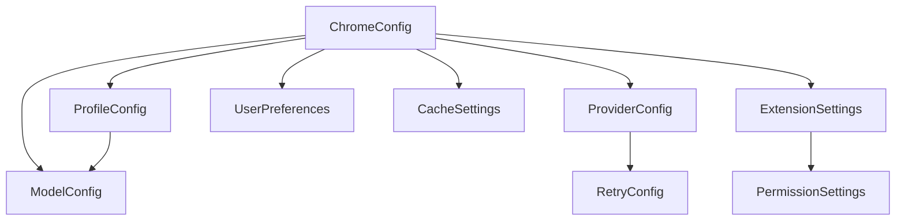

# Data Model: Chrome Extension Configuration

## Overview
This document defines the data structures for the Chrome extension configuration system, replacing the terminal-based config from codex-rs with browser-appropriate settings.

## Core Entities

### 1. ChromeConfig
**Purpose**: Root configuration object containing all settings

**Fields**:
- `version: string` - Schema version for migration support (e.g., "1.0.0")
- `model: ModelConfig` - Active model configuration
- `providers: Map<string, ProviderConfig>` - Available model providers
- `profiles: Map<string, ProfileConfig>` - Named configuration profiles
- `activeProfile: string | null` - Currently active profile name
- `preferences: UserPreferences` - User-specific preferences
- `cache: CacheSettings` - Cache configuration
- `extension: ExtensionSettings` - Chrome extension specific settings

**Validation Rules**:
- version must match semantic versioning pattern
- activeProfile must exist in profiles map if not null
- At least one provider must be configured

**State Transitions**:
- Initial → Configured (after first setup)
- Configured → Migrating (during version upgrade)
- Migrating → Configured (after successful migration)

### 2. ModelConfig
**Purpose**: Configuration for the active AI model

**Fields**:
- `selected: string` - Model identifier (e.g., "gpt-4", "claude-3")
- `provider: string` - Provider key from providers map
- `contextWindow: number | null` - Token window size
- `maxOutputTokens: number | null` - Maximum output tokens
- `autoCompactTokenLimit: number | null` - Auto-compaction threshold
- `reasoningEffort: 'low' | 'medium' | 'high' | null` - Reasoning effort level
- `reasoningSummary: 'none' | 'brief' | 'detailed'` - Summary generation
- `verbosity: 'low' | 'medium' | 'high' | null` - Output verbosity

**Validation Rules**:
- selected must be non-empty string
- provider must exist in providers map
- contextWindow if set must be > 0
- maxOutputTokens if set must be > 0 and <= contextWindow

### 3. ProviderConfig
**Purpose**: Model provider configuration (OpenAI, Anthropic, etc.)

**Fields**:
- `id: string` - Unique provider identifier
- `name: string` - Display name
- `apiKey: string` - API key (encrypted in storage)
- `baseUrl: string | null` - Optional custom API endpoint
- `organization: string | null` - Organization ID (OpenAI)
- `version: string | null` - API version (Anthropic)
- `headers: Map<string, string>` - Additional HTTP headers
- `timeout: number` - Request timeout in milliseconds
- `retryConfig: RetryConfig` - Retry settings

**Validation Rules**:
- id must be unique across providers
- apiKey must be non-empty (validated on save)
- baseUrl if set must be valid HTTPS URL
- timeout must be between 1000 and 60000 ms

### 4. ProfileConfig
**Purpose**: Named configuration profile for quick switching

**Fields**:
- `name: string` - Profile name
- `description: string | null` - Optional description
- `model: string` - Model selection for this profile
- `provider: string` - Provider for this profile
- `modelSettings: Partial<ModelConfig>` - Override model settings
- `created: number` - Creation timestamp
- `lastUsed: number | null` - Last activation timestamp

**Validation Rules**:
- name must be unique across profiles
- model and provider must be valid
- created must be valid timestamp

### 5. UserPreferences
**Purpose**: User-configurable preferences

**Fields**:
- `autoSync: boolean` - Enable settings sync across devices
- `telemetryEnabled: boolean` - Opt-in for usage telemetry
- `theme: 'light' | 'dark' | 'system'` - UI theme preference
- `shortcuts: Map<string, string>` - Keyboard shortcuts
- `experimental: Map<string, boolean>` - Feature flags

**Validation Rules**:
- All boolean fields must have default values
- shortcuts keys must match valid command names

### 6. CacheSettings
**Purpose**: Cache configuration for API responses

**Fields**:
- `enabled: boolean` - Master cache toggle
- `ttl: number` - Time-to-live in seconds
- `maxSize: number` - Maximum cache size in bytes
- `compressionEnabled: boolean` - Enable compression for large responses
- `persistToStorage: boolean` - Persist cache across sessions

**Validation Rules**:
- ttl must be between 0 and 86400 (24 hours)
- maxSize must be between 0 and storage quota

### 7. ExtensionSettings
**Purpose**: Chrome extension specific settings

**Fields**:
- `enabled: boolean` - Master extension toggle
- `contentScriptEnabled: boolean` - Enable content script injection
- `allowedOrigins: string[]` - CORS allowed origins
- `storageQuotaWarning: number` - Warning threshold (0-1)
- `updateChannel: 'stable' | 'beta'` - Update channel preference
- `permissions: PermissionSettings` - Permission configurations

**Validation Rules**:
- allowedOrigins must be valid URL patterns
- storageQuotaWarning must be between 0 and 1

### 8. RetryConfig
**Purpose**: API retry configuration

**Fields**:
- `maxRetries: number` - Maximum retry attempts
- `initialDelay: number` - Initial delay in ms
- `maxDelay: number` - Maximum delay in ms
- `backoffMultiplier: number` - Exponential backoff multiplier

**Validation Rules**:
- maxRetries between 0 and 10
- initialDelay < maxDelay
- backoffMultiplier between 1 and 3

### 9. PermissionSettings
**Purpose**: Chrome permission configurations

**Fields**:
- `tabs: boolean` - Access to browser tabs
- `storage: boolean` - Storage access (always true)
- `notifications: boolean` - Show notifications
- `clipboardRead: boolean` - Read clipboard
- `clipboardWrite: boolean` - Write clipboard

**Validation Rules**:
- storage must always be true (required for operation)

## Storage Schema

### Primary Storage Key
`codex_config_v1` - Main configuration object

### Secondary Storage Keys
- `codex_config_backup` - Backup before migration
- `codex_config_cache` - Cached API responses
- `codex_config_profiles_{name}` - Individual profile data (if > 8KB)

### Migration Version Tracking
- `codex_config_version` - Current schema version
- `codex_config_migration_history` - Array of completed migrations

## Relationships

## Data Constraints

### Storage Limits
- Total config size must not exceed 100KB for sync storage
- Individual items must not exceed 8KB
- Profile data may be split if exceeding 8KB limit

### Security
- API keys must be encrypted before storage
- Sensitive data must not be logged
- CORS origins must be explicitly whitelisted

### Performance
- Config reads should be cached in memory
- Batch storage operations when possible
- Implement debouncing for frequent config updates

## Migration Path

### From Current System (ModelClientFactory)
1. Read existing keys: `openai_api_key`, `anthropic_api_key`, `default_provider`
2. Map to new structure under `providers`
3. Create default profile with current settings
4. Set version to "1.0.0"
5. Clean up old keys after successful migration

### Future Migrations
- Check `codex_config_version`
- Run migration scripts in sequence
- Backup before each migration
- Validate after migration
- Update version on success