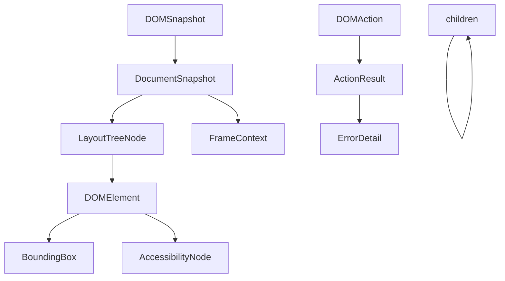

# Data Model: DOM Tool Integration

**Date**: 2025-09-26
**Feature**: DOM Tool Integration for Chrome Extension Agent

## Core Entities

### 1. DOMElement
Represents a single element in the page DOM.

**Properties**:
- `tagName: string` - HTML tag name (e.g., "div", "button")
- `id?: string` - Element ID attribute
- `className?: string` - Element class attribute
- `textContent?: string` - Visible text content
- `innerHTML?: string` - Inner HTML content
- `outerHTML?: string` - Complete HTML including element itself
- `attributes: Record<string, string>` - All element attributes
- `boundingBox?: BoundingBox` - Position and dimensions
- `visible?: boolean` - Visibility state
- `enabled?: boolean` - Interactability state
- `focused?: boolean` - Focus state

**Validations**:
- tagName must be non-empty
- attributes keys must be valid HTML attribute names
- boundingBox coordinates must be non-negative

### 2. BoundingBox
Represents element position and dimensions.

**Properties**:
- `x: number` - X coordinate relative to viewport
- `y: number` - Y coordinate relative to viewport
- `width: number` - Element width
- `height: number` - Element height
- `top: number` - Top edge position
- `left: number` - Left edge position
- `bottom: number` - Bottom edge position
- `right: number` - Right edge position

**Validations**:
- All values must be non-negative
- width and height must be >= 0
- bottom = top + height
- right = left + width

### 3. DOMTreeNode
Hierarchical representation of DOM structure.

**Properties**:
- `nodeId: number` - Unique node identifier
- `parentId?: number` - Parent node ID
- `nodeType: NodeType` - Element, text, comment, etc.
- `nodeName: string` - Tag name or node type
- `nodeValue?: string` - Text content for text nodes
- `childNodeIndexes?: number[]` - Child node indices
- `attributes?: Array<{name: string, value: string}>` - Node attributes
- `backendNodeId?: number` - Backend reference

**State Transitions**:
- Created → Modified → Removed
- Visible → Hidden → Visible
- Enabled → Disabled → Enabled

### 4. AccessibilityNode
Enhanced element with accessibility properties.

**Properties**:
- `nodeId: string` - Accessibility tree node ID
- `ignored: boolean` - Whether node is ignored by screen readers
- `role?: { type: string, value: string }` - ARIA role
- `name?: { type: string, value: string }` - Accessible name
- `description?: { type: string, value: string }` - Accessible description
- `value?: { type: string, value: any }` - Current value
- `properties?: Array<{ name: string, value: any }>` - Additional properties
- `childIds?: string[]` - Child node IDs
- `backendDOMNodeId?: number` - Corresponding DOM node

**Validations**:
- role.value must be valid ARIA role
- ignored nodes should not have semantic properties

### 5. DOMSnapshot
Complete DOM state at a point in time.

**Properties**:
- `documents: DocumentSnapshot[]` - All documents (main + iframes)
- `strings: string[]` - String table for deduplication
- `timestamp: number` - Capture timestamp
- `url: string` - Page URL
- `title: string` - Page title
- `viewport: { width: number, height: number }` - Viewport dimensions

**Validations**:
- At least one document required
- timestamp must be valid Unix timestamp
- viewport dimensions must be positive

### 6. DocumentSnapshot
Single document within a snapshot.

**Properties**:
- `documentURL: string` - Document URL
- `title: string` - Document title
- `baseURL: string` - Base URL for relative paths
- `contentLanguage?: string` - Content language
- `encodingName: string` - Character encoding
- `frameId?: string` - Frame identifier for iframes
- `nodes: LayoutTreeNode[]` - Document nodes
- `layout: LayoutTreeSnapshot` - Layout information
- `textBoxes: TextBoxSnapshot` - Text positioning
- `scrollOffsets?: { x: number, y: number }` - Scroll position

### 7. DOMAction
Represents an action to perform on DOM.

**Properties**:
- `action: ActionType` - Type of action
- `selector?: string` - Target element selector
- `value?: any` - Action payload
- `options?: ActionOptions` - Execution options
- `timestamp: number` - Action timestamp

**ActionType enum**:
- `query` - Find elements
- `click` - Click element
- `type` - Type text
- `getAttribute` - Read attribute
- `setAttribute` - Write attribute
- `getText` - Extract text
- `getHtml` - Extract HTML
- `submit` - Submit form
- `focus` - Focus element
- `scroll` - Scroll to element

### 8. ActionResult
Result of a DOM action execution.

**Properties**:
- `success: boolean` - Whether action succeeded
- `data?: any` - Result data
- `error?: ErrorDetail` - Error information if failed
- `duration: number` - Execution time in ms
- `retries: number` - Number of retry attempts

### 9. ErrorDetail
Structured error information.

**Properties**:
- `code: string` - Error code (e.g., "ELEMENT_NOT_FOUND")
- `message: string` - Human-readable message
- `selector?: string` - Selector that failed
- `action?: string` - Action that failed
- `context?: any` - Additional context

**Error Codes**:
- `ELEMENT_NOT_FOUND` - Selector matched no elements
- `ELEMENT_NOT_VISIBLE` - Element exists but not visible
- `ELEMENT_NOT_INTERACTABLE` - Element visible but can't interact
- `TIMEOUT` - Operation timed out
- `INVALID_SELECTOR` - Malformed selector
- `CROSS_ORIGIN_FRAME` - Cannot access cross-origin iframe
- `SCRIPT_INJECTION_FAILED` - Content script injection failed

### 10. FrameContext
Information about iframe/frame containers.

**Properties**:
- `frameId: string` - Unique frame identifier
- `parentFrameId?: string` - Parent frame ID
- `url: string` - Frame URL
- `origin: string` - Frame origin
- `name?: string` - Frame name attribute
- `sandboxed: boolean` - Whether frame is sandboxed
- `crossOrigin: boolean` - Whether frame is cross-origin
- `depth: number` - Nesting depth (0 for main frame)

## Relationships

## State Management

### Element States
- **Initial**: Element discovered but not analyzed
- **Analyzed**: Properties computed and cached
- **Interacted**: Element has been interacted with
- **Stale**: Element may have changed, needs revalidation

### Snapshot States
- **Capturing**: Snapshot being generated
- **Complete**: All data captured
- **Partial**: Some frames/data unavailable
- **Expired**: Too old, needs refresh

### Action States
- **Pending**: Action queued
- **Executing**: Action in progress
- **Completed**: Action finished successfully
- **Failed**: Action failed, may retry
- **Abandoned**: Action failed, no more retries

## Constraints and Invariants

1. **Unique Identifiers**: All nodeIds within a document must be unique
2. **Parent-Child Consistency**: Parent references must be bidirectional
3. **Frame Hierarchy**: Frame depth must match parent chain length
4. **Selector Validity**: Selectors must be valid CSS or XPath syntax
5. **Timestamp Ordering**: Actions must have increasing timestamps
6. **Retry Limits**: Max 3 retries per action
7. **Timeout Bounds**: Timeouts between 100ms and 30000ms
8. **Text Length**: Text content capped at 10000 characters for performance

## Serialization Format

All entities use JSON serialization with:
- camelCase property names
- ISO 8601 timestamps
- UTF-8 encoding
- Optional properties omitted when undefined
- Arrays default to empty
- Numbers use IEEE 754 double precision

## Performance Considerations

1. **String Deduplication**: Reuse strings in snapshot string table
2. **Lazy Loading**: Compute expensive properties on demand
3. **Incremental Updates**: Track DOM mutations instead of full recapture
4. **Batch Operations**: Group multiple actions in single message
5. **Caching**: Cache computed styles and accessibility tree
6. **Compression**: Gzip large snapshots for storage/transmission