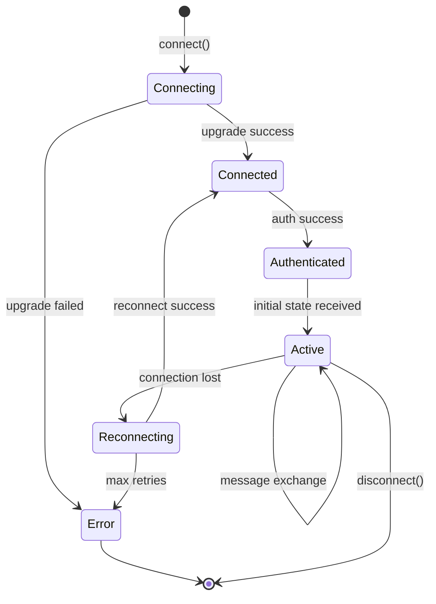

# WebSocket Protocol Specification

**Feature**: TypeScript Web-Based Implementation of Codex
**Date**: 2025-09-19
**Version**: 1.0.0

## Connection

### Endpoint
```
ws://localhost:3000/ws?sessionId={sessionId}
```

### Authentication
- Bearer token in `Authorization` header during handshake
- Or session token in query parameter for browser compatibility

### Connection Lifecycle
1. Client initiates WebSocket connection with session ID
2. Server validates session and upgrades connection
3. Server sends initial state message
4. Bidirectional communication established
5. Heartbeat/ping-pong every 30 seconds
6. Automatic reconnection on disconnect

## Message Format

All messages follow this structure:

```typescript
interface WebSocketMessage {
  id: string;           // UUID for message tracking
  type: string;         // Message type identifier
  payload: any;         // Type-specific payload
  timestamp: string;    // ISO 8601 timestamp
  sessionId: string;    // Associated session
  sequenceNumber: number; // For ordering
}
```

## Client → Server Messages

### 1. Send Message
```json
{
  "type": "SEND_MESSAGE",
  "payload": {
    "content": "string",
    "attachments": []
  }
}
```

### 2. Execute Task
```json
{
  "type": "EXECUTE_TASK",
  "payload": {
    "taskType": "file_read | file_write | execute_command | ...",
    "input": {}
  }
}
```

### 3. Cancel Task
```json
{
  "type": "CANCEL_TASK",
  "payload": {
    "taskId": "uuid"
  }
}
```

### 4. Update Configuration
```json
{
  "type": "UPDATE_CONFIG",
  "payload": {
    "configId": "uuid",
    "changes": {}
  }
}
```

### 5. File Operation
```json
{
  "type": "FILE_OPERATION",
  "payload": {
    "operation": "read | write | delete | rename",
    "path": "string",
    "content": "string (for write)",
    "newPath": "string (for rename)"
  }
}
```

### 6. MCP Request
```json
{
  "type": "MCP_REQUEST",
  "payload": {
    "connectionId": "uuid",
    "method": "string",
    "params": {}
  }
}
```

### 7. Search Files
```json
{
  "type": "SEARCH_FILES",
  "payload": {
    "query": "string",
    "fuzzy": true
  }
}
```

### 8. Heartbeat
```json
{
  "type": "HEARTBEAT",
  "payload": {
    "timestamp": "ISO 8601"
  }
}
```

## Server → Client Messages

### 1. Initial State
```json
{
  "type": "INITIAL_STATE",
  "payload": {
    "session": {},
    "agent": {},
    "conversation": {},
    "connections": []
  }
}
```

### 2. Agent Status Update
```json
{
  "type": "AGENT_STATUS",
  "payload": {
    "agentId": "uuid",
    "status": "idle | thinking | executing | waiting_input | error",
    "currentTask": {}
  }
}
```

### 3. Task Update
```json
{
  "type": "TASK_UPDATE",
  "payload": {
    "taskId": "uuid",
    "status": "pending | running | completed | failed | cancelled",
    "progress": 0.5,
    "output": {},
    "error": "string"
  }
}
```

### 4. Conversation Message
```json
{
  "type": "CONVERSATION_MESSAGE",
  "payload": {
    "message": {
      "id": "uuid",
      "role": "user | assistant | system",
      "content": "string",
      "timestamp": "ISO 8601"
    }
  }
}
```

### 5. File Change Notification
```json
{
  "type": "FILE_CHANGE",
  "payload": {
    "path": "string",
    "changeType": "created | modified | deleted",
    "timestamp": "ISO 8601"
  }
}
```

### 6. MCP Event
```json
{
  "type": "MCP_EVENT",
  "payload": {
    "connectionId": "uuid",
    "event": "connected | disconnected | error | data",
    "data": {}
  }
}
```

### 7. Configuration Update
```json
{
  "type": "CONFIG_UPDATE",
  "payload": {
    "configId": "uuid",
    "changes": {},
    "timestamp": "ISO 8601"
  }
}
```

### 8. Notification
```json
{
  "type": "NOTIFICATION",
  "payload": {
    "id": "uuid",
    "title": "string",
    "message": "string",
    "severity": "info | warning | error | success",
    "timestamp": "ISO 8601"
  }
}
```

### 9. Error
```json
{
  "type": "ERROR",
  "payload": {
    "code": "string",
    "message": "string",
    "details": {},
    "relatedMessageId": "uuid"
  }
}
```

### 10. Search Results
```json
{
  "type": "SEARCH_RESULTS",
  "payload": {
    "query": "string",
    "results": [
      {
        "path": "string",
        "line": 0,
        "content": "string",
        "score": 0.95
      }
    ]
  }
}
```

### 11. Heartbeat Acknowledgment
```json
{
  "type": "HEARTBEAT_ACK",
  "payload": {
    "timestamp": "ISO 8601",
    "serverTime": "ISO 8601"
  }
}
```

## Error Codes

| Code | Description |
|------|-------------|
| WS_1001 | Invalid message format |
| WS_1002 | Unknown message type |
| WS_1003 | Unauthorized session |
| WS_1004 | Session expired |
| WS_1005 | Rate limit exceeded |
| WS_1006 | Invalid payload |
| WS_1007 | Task not found |
| WS_1008 | File access denied |
| WS_1009 | MCP connection failed |
| WS_1010 | Internal server error |

## Rate Limiting

- Maximum 100 messages per minute per connection
- Maximum 10 concurrent tasks per session
- Maximum 1MB message size
- File operations limited to 10 per second

## Binary Protocol (Future)

For performance-critical operations, binary frames using MessagePack:

```typescript
interface BinaryFrame {
  version: uint8;      // Protocol version
  type: uint8;         // Message type enum
  flags: uint8;        // Compression, encryption flags
  sequenceNumber: uint32;
  timestamp: uint64;   // Unix timestamp ms
  payloadLength: uint32;
  payload: Buffer;     // MessagePack encoded
}
```

## Connection States



## Security Considerations

1. **Message Validation**: All incoming messages validated against schema
2. **Rate Limiting**: Per-connection and per-session limits
3. **Origin Validation**: CORS headers checked during handshake
4. **Encryption**: TLS/WSS required for production
5. **Token Rotation**: JWT tokens refreshed periodically
6. **Input Sanitization**: All user input sanitized before processing

## Testing Protocol

### Test Messages
```typescript
// Test connection
{ type: "PING", payload: {} }
// Expected: { type: "PONG", payload: {} }

// Test echo
{ type: "ECHO", payload: { data: "test" } }
// Expected: { type: "ECHO_RESPONSE", payload: { data: "test" } }
```

---
*WebSocket protocol specification complete.*