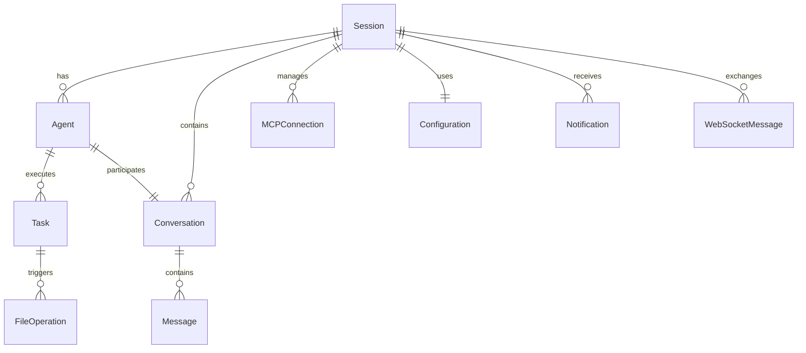

# Data Model Specification

**Feature**: TypeScript Web-Based Implementation of Codex
**Date**: 2025-09-19
**Phase**: Technical Design

## Core Entities

### 1. Session
Represents an active user session with the Codex system.

```typescript
interface Session {
  id: string;                    // UUID
  userId?: string;                // Optional for local mode
  workspaceDir: string;           // Active workspace directory
  config: Configuration;          // Active configuration
  createdAt: Date;
  lastActivityAt: Date;
  status: 'active' | 'idle' | 'disconnected';
}
```

**Validation Rules**:
- `id` must be unique UUID v4
- `workspaceDir` must be valid absolute path
- `lastActivityAt` updated on any user interaction
- Session expires after 24 hours of inactivity

### 2. Configuration
System and user configuration settings.

```typescript
interface Configuration {
  id: string;                     // UUID
  name: string;                   // Config profile name
  sandboxMode: SandboxMode;
  mcpServers: MCPServerConfig[];
  notificationSettings: NotificationConfig;
  authEnabled: boolean;
  customSettings: Record<string, any>;
  createdAt: Date;
  updatedAt: Date;
}

enum SandboxMode {
  READ_ONLY = 'read-only',
  WORKSPACE_WRITE = 'workspace-write',
  FULL_ACCESS = 'danger-full-access'
}
```

**Validation Rules**:
- `sandboxMode` defaults to READ_ONLY
- `mcpServers` array can be empty
- `customSettings` must be valid JSON object

### 3. Agent
Represents an AI agent instance managing operations.

```typescript
interface Agent {
  id: string;                     // UUID
  sessionId: string;              // Associated session
  model: string;                  // Model identifier
  status: AgentStatus;
  currentTask?: Task;
  conversationId: string;
  createdAt: Date;
  lastResponseAt?: Date;
}

enum AgentStatus {
  IDLE = 'idle',
  THINKING = 'thinking',
  EXECUTING = 'executing',
  WAITING_INPUT = 'waiting_input',
  ERROR = 'error'
}
```

**Validation Rules**:
- `model` must be supported model type
- Status transitions follow state machine rules
- `conversationId` links to conversation entity

### 4. Conversation
Maintains conversation history and context.

```typescript
interface Conversation {
  id: string;                     // UUID
  sessionId: string;
  messages: Message[];
  context: ConversationContext;
  createdAt: Date;
  updatedAt: Date;
}

interface Message {
  id: string;                     // UUID
  role: 'user' | 'assistant' | 'system';
  content: string;
  attachments?: Attachment[];
  timestamp: Date;
  metadata?: MessageMetadata;
}

interface ConversationContext {
  workspaceFiles: string[];       // Relevant file paths
  activeFile?: string;
  recentCommands: string[];
  environment: Record<string, string>;
}
```

**Validation Rules**:
- Messages ordered by timestamp
- `role` must be valid enum value
- `content` max length 100,000 characters

### 5. Task
Represents an executable task or operation.

```typescript
interface Task {
  id: string;                     // UUID
  agentId: string;
  type: TaskType;
  status: TaskStatus;
  input: any;                     // Task-specific input
  output?: any;                   // Task result
  error?: string;
  startedAt: Date;
  completedAt?: Date;
  metadata: TaskMetadata;
}

enum TaskType {
  FILE_READ = 'file_read',
  FILE_WRITE = 'file_write',
  FILE_SEARCH = 'file_search',
  EXECUTE_COMMAND = 'execute_command',
  MCP_REQUEST = 'mcp_request',
  CODE_GENERATION = 'code_generation'
}

enum TaskStatus {
  PENDING = 'pending',
  RUNNING = 'running',
  COMPLETED = 'completed',
  FAILED = 'failed',
  CANCELLED = 'cancelled'
}
```

**Validation Rules**:
- Status transitions: PENDING → RUNNING → (COMPLETED|FAILED|CANCELLED)
- `completedAt` set only when status is terminal
- `error` required when status is FAILED

### 6. MCPConnection
Manages Model Context Protocol connections.

```typescript
interface MCPConnection {
  id: string;                     // UUID
  sessionId: string;
  serverUrl: string;
  status: ConnectionStatus;
  capabilities: string[];
  lastPingAt?: Date;
  metadata: MCPMetadata;
}

enum ConnectionStatus {
  CONNECTING = 'connecting',
  CONNECTED = 'connected',
  DISCONNECTED = 'disconnected',
  ERROR = 'error'
}

interface MCPMetadata {
  version: string;
  serverName: string;
  supportedProtocols: string[];
}
```

**Validation Rules**:
- `serverUrl` must be valid URL
- Ping every 30 seconds to maintain connection
- Auto-reconnect on disconnect

### 7. FileOperation
Tracks file system operations for auditing and undo.

```typescript
interface FileOperation {
  id: string;                     // UUID
  sessionId: string;
  type: 'read' | 'write' | 'delete' | 'rename';
  path: string;
  previousContent?: string;       // For undo capability
  newContent?: string;
  timestamp: Date;
  taskId?: string;                // Associated task
  status: 'success' | 'failed';
  error?: string;
}
```

**Validation Rules**:
- `path` must be within workspace directory
- `previousContent` stored for write/delete operations
- Max content size: 10MB

### 8. Notification
System and user notifications.

```typescript
interface Notification {
  id: string;                     // UUID
  sessionId: string;
  type: NotificationType;
  title: string;
  message: string;
  severity: 'info' | 'warning' | 'error' | 'success';
  timestamp: Date;
  read: boolean;
  metadata?: any;
}

enum NotificationType {
  TASK_COMPLETE = 'task_complete',
  ERROR = 'error',
  SYSTEM = 'system',
  MCP_EVENT = 'mcp_event'
}
```

**Validation Rules**:
- `title` max 100 characters
- `message` max 1000 characters
- Auto-expire after 7 days

### 9. WebSocketMessage
Protocol for real-time communication.

```typescript
interface WebSocketMessage {
  id: string;                     // UUID
  type: WSMessageType;
  payload: any;
  timestamp: Date;
  sessionId: string;
  sequenceNumber: number;         // For ordering
}

enum WSMessageType {
  AGENT_STATUS = 'agent_status',
  TASK_UPDATE = 'task_update',
  FILE_CHANGE = 'file_change',
  CONVERSATION_MESSAGE = 'conversation_message',
  MCP_EVENT = 'mcp_event',
  CONFIG_UPDATE = 'config_update',
  HEARTBEAT = 'heartbeat'
}
```

**Validation Rules**:
- Messages delivered in sequence order
- Heartbeat every 30 seconds
- Automatic reconnection on disconnect

## State Transitions

### Agent State Machine
```
IDLE → THINKING → EXECUTING → IDLE
         ↓           ↓
    WAITING_INPUT   ERROR
         ↓           ↓
       THINKING     IDLE
```

### Task State Machine
```
PENDING → RUNNING → COMPLETED
            ↓
          FAILED
            ↓
        CANCELLED
```

### Connection State Machine
```
DISCONNECTED → CONNECTING → CONNECTED
      ↑            ↓            ↓
      └────────ERROR←───────────┘
```

## Relationships



## Data Persistence

### Server-Side Storage
- **PostgreSQL** (future): Sessions, Conversations, Tasks
- **File System**: Configurations (TOML files), File operations
- **In-Memory**: Active WebSocket connections, Agent status

### Client-Side Storage
- **IndexedDB**: Message cache, File cache
- **LocalStorage**: User preferences, Session token
- **SessionStorage**: Temporary UI state

## Validation Schema (Zod)

```typescript
import { z } from 'zod';

export const SessionSchema = z.object({
  id: z.string().uuid(),
  userId: z.string().uuid().optional(),
  workspaceDir: z.string().min(1),
  config: z.lazy(() => ConfigurationSchema),
  createdAt: z.date(),
  lastActivityAt: z.date(),
  status: z.enum(['active', 'idle', 'disconnected'])
});

export const TaskSchema = z.object({
  id: z.string().uuid(),
  agentId: z.string().uuid(),
  type: z.enum(['file_read', 'file_write', 'file_search',
                 'execute_command', 'mcp_request', 'code_generation']),
  status: z.enum(['pending', 'running', 'completed', 'failed', 'cancelled']),
  input: z.any(),
  output: z.any().optional(),
  error: z.string().optional(),
  startedAt: z.date(),
  completedAt: z.date().optional(),
  metadata: z.record(z.any())
});

// Additional schemas for all entities...
```

## Migration from Rust

### Mapping Rust Structures to TypeScript

| Rust Component | TypeScript Entity | Notes |
|----------------|-------------------|-------|
| `Config` struct | `Configuration` | Add web-specific fields |
| `ExecPolicy` | `Task` + validation | Implement in service layer |
| `MCPClient` | `MCPConnection` | WebSocket-based |
| `TuiState` | `Session` + UI state | Split backend/frontend |
| `SandboxPolicy` | `SandboxMode` enum | Simplified for web |

## Performance Considerations

1. **Pagination**: All list queries support pagination
2. **Indexing**: Index on sessionId, timestamp, status fields
3. **Caching**: Message and file content cached client-side
4. **Compression**: WebSocket messages compressed with zlib
5. **Cleanup**: Old sessions/messages purged after 30 days

---
*Data model specification complete. Ready for API contract generation.*