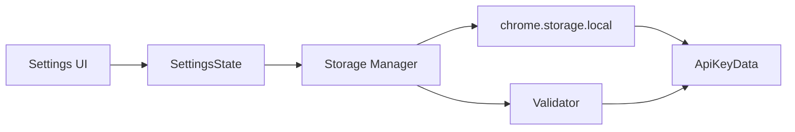

# Data Model: Sidepanel Settings with OpenAI API Key Management

**Feature**: 003-currently-in-sidepanel
**Date**: 2025-09-26
**Version**: 1.0.0

## Entities

### ApiKeyData
**Purpose**: Stores OpenAI API key and metadata
**Storage**: chrome.storage.local

| Field | Type | Required | Description | Validation |
|-------|------|----------|-------------|------------|
| apiKey | string | Yes | OpenAI API key | Must start with "sk-", min 40 chars |
| createdAt | number | Yes | Unix timestamp of creation | Valid timestamp |
| lastModified | number | Yes | Unix timestamp of last update | Valid timestamp |
| isValid | boolean | Yes | Format validation status | Computed from apiKey |

**Constraints**:
- Only one ApiKeyData object stored at a time
- Storage key: "openai_apikey"
- Maximum storage size: 8KB (Chrome limit per key)

### SettingsState
**Purpose**: UI state for settings modal
**Storage**: In-memory only (not persisted)

| Field | Type | Required | Description | Default |
|-------|------|----------|-------------|---------|
| isOpen | boolean | Yes | Modal visibility | false |
| isLoading | boolean | Yes | Async operation in progress | false |
| error | string \| null | No | Current error message | null |
| success | string \| null | No | Success message | null |
| hasApiKey | boolean | Yes | Whether key exists in storage | false |
| maskedKey | string \| null | No | Display format of key | null |

**State Transitions**:
- `closed → opening → open`
- `open → saving → open (with message)`
- `open → closing → closed`

### StorageSchema
**Purpose**: Type-safe storage operations
**Storage**: chrome.storage.local schema

```typescript
interface StorageSchema {
  openai_apikey: ApiKeyData | null;
  settings_version: string;  // For future migrations
}
```

## Relationships



## Operations

### Create/Update API Key
1. Validate format (sk-..., length)
2. Create ApiKeyData object
3. Store in chrome.storage.local
4. Update SettingsState
5. Display success message

### Read API Key
1. Fetch from chrome.storage.local
2. Check if exists
3. Mask for display (first 6 chars + ***)
4. Update SettingsState

### Delete API Key
1. Confirm with user
2. Remove from chrome.storage.local
3. Clear SettingsState
4. Display confirmation

## Validation Rules

### API Key Format
- **Pattern**: `/^sk-[A-Za-z0-9]{40,}$/`
- **Minimum Length**: 43 characters
- **Maximum Length**: 200 characters
- **Required Prefix**: "sk-"

### Storage Quotas
- **Per-key limit**: 8,192 bytes
- **Total local storage**: 10 MB
- **Quota check**: Before each save operation

## Error Handling

| Error | Code | User Message | Recovery |
|-------|------|--------------|----------|
| Invalid format | INVALID_KEY | "API key must start with 'sk-' and be at least 43 characters" | Show inline, keep form open |
| Storage quota | QUOTA_EXCEEDED | "Storage limit reached. Please clear some data." | Offer to clear old data |
| Storage access | STORAGE_ERROR | "Could not save settings. Changes are temporary." | Use memory fallback |
| Missing key | KEY_NOT_FOUND | "No API key configured" | Show "Add API Key" button |

## Migration Strategy

### Version 1.0.0 (Initial)
- Store under "openai_apikey" key
- No encryption (Chrome handles it)
- Single key support

### Future Versions
- Version field for migration detection
- Backward compatibility for 2 versions
- Automatic migration on first access

## Security Notes

1. **Never log API keys** in console or errors
2. **Clear input fields** after successful save
3. **Use Chrome's built-in encryption** for storage
4. **Mask keys** in all UI displays
5. **Clear clipboard** after paste operations
6. **Rate limit** storage operations (max 1/second)